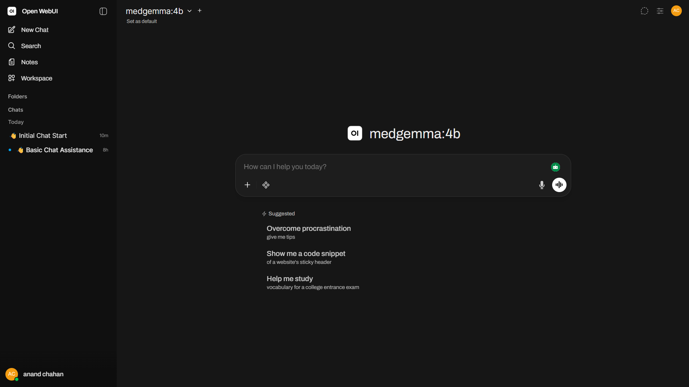

# Nova - Jetson Orin Nano AI Voice Assistant

Nova is a fully offline AI voice assistant running on NVIDIA Jetson Orin Nano using local LLMs, speech recognition, text-to-speech, and a secure remote access pipeline.

Built using:

- Ollama
- Phi-3 Mini
- Faster-Whisper
- Open WebUI
- KittenTTS
- Cloudflare Tunnel
- Docker

Nova provides a private ChatGPT-style AI assistant running completely on edge hardware.

---

# Features

- Offline AI assistant
- Voice interaction
- Local LLM inference
- Remote SSH access
- Browser-based AI interface
- GPU accelerated AI inference
- Edge AI deployment
- Secure remote access using Cloudflare Tunnel
- Open WebUI integration
- Local-first architecture

---

# Hardware Used

- NVIDIA Jetson Orin Nano
- USB Microphone
- Speaker / Audio Output
- Remote Laptop

---

# Software Stack

| Component | Purpose |
|---|---|
| Ollama | Local LLM runtime |
| Phi-3 Mini | Main AI model |
| Faster-Whisper | Speech-to-text |
| KittenTTS | Text-to-speech |
| Open WebUI | Browser interface |
| Docker | Containerization |
| Cloudflare Tunnel | Secure remote access |

---

# Architecture

```text
Microphone
    ↓
Faster-Whisper
    ↓
Phi-3 Mini (Ollama)
    ↓
KittenTTS
    ↓
Speaker
```

---

# Screenshots

## Open WebUI





## Voice Assistant


## Jetson Setup

```text

```

---

# Installation

## 1. Install Docker

```bash
sudo apt update
sudo apt install docker.io -y
sudo systemctl enable docker
sudo systemctl start docker
```

---

## 2. Install Ollama Container

```bash
docker run -d \
  --network host \
  --restart unless-stopped \
  -v ~/ollama:/ollama \
  -e OLLAMA_MODELS=/ollama \
  --name ollama \
  ghcr.io/nvidia-ai-iot/ollama:r38.2.arm64-sbsa-cu130-24.04 \
  ollama serve
```

---

## 3. Pull Phi-3 Mini

```bash
docker exec -it ollama ollama pull phi3
```

---

## 4. Install Open WebUI

```bash
docker run -d \
  --network host \
  --name open-webui \
  --restart unless-stopped \
  -e OLLAMA_BASE_URL=http://localhost:11434 \
  -v open-webui:/app/backend/data \
  ghcr.io/open-webui/open-webui:main
```

---

# Cloudflare Tunnel Setup

## SSH Access

```bash
ssh -o ProxyCommand="cloudflared access ssh --hostname %h" killer@killer.sugarcoat.tech
```

## Web UI Access

```text
https://ai.sugarcoat.tech
```

---

# Voice Assistant Setup

## Install Dependencies

```bash
pip install sounddevice soundfile scipy requests faster-whisper kittentts
```

---

## Run Voice Assistant

```bash
python3 voice_chat.py
```

---

# Open WebUI

Open:

```text
http://localhost:8080
```

or remotely:

```text
https://ai.sugarcoat.tech
```

---

# Project Structure

```text
nova/
│
├── README.md
├── requirements.txt
├── voice_chat.py
├── app.py
├── screenshots/
├── docs/
├── static/
├── templates/
├── setup/
└── scripts/
```

---

# Future Roadmap

- Wake word support
- Streaming voice responses
- Vision AI integration
- RAG / memory system
- Mobile app
- Home automation
- Hindi voice support
- Multi-agent support
- Robotics integration
- GPIO control
- LoRaWAN integration

---

# Why I Built This

Nova was built to explore:

- Edge AI deployment
- Local-first AI systems
- Offline AI assistants
- Real-time voice AI
- NVIDIA Jetson AI workflows
- Remote AI infrastructure

The goal was to create a fully private AI assistant capable of running locally on embedded hardware without relying on cloud inference.

---

# Tags

jetson  
jetson-orin  
ollama  
phi3  
edge-ai  
voice-assistant  
open-webui  
local-llm  
whisper  
kittentts  
cloudflare-tunnel  
nvidia-jetson  

---

# License

MIT License
